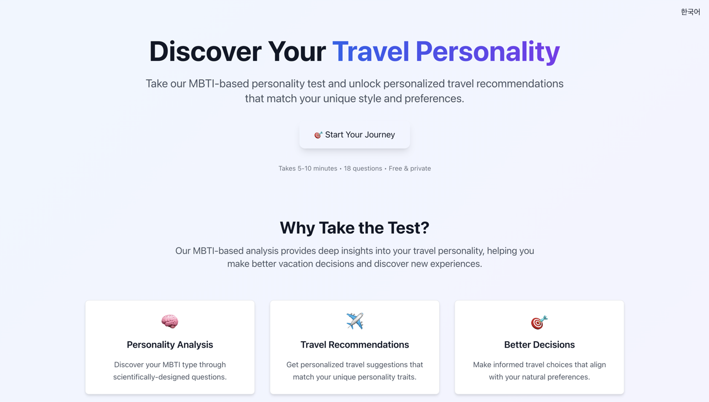
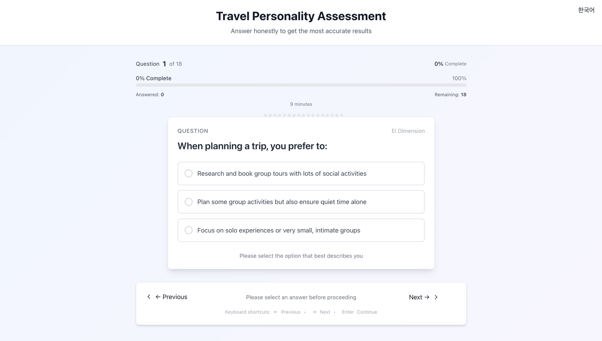
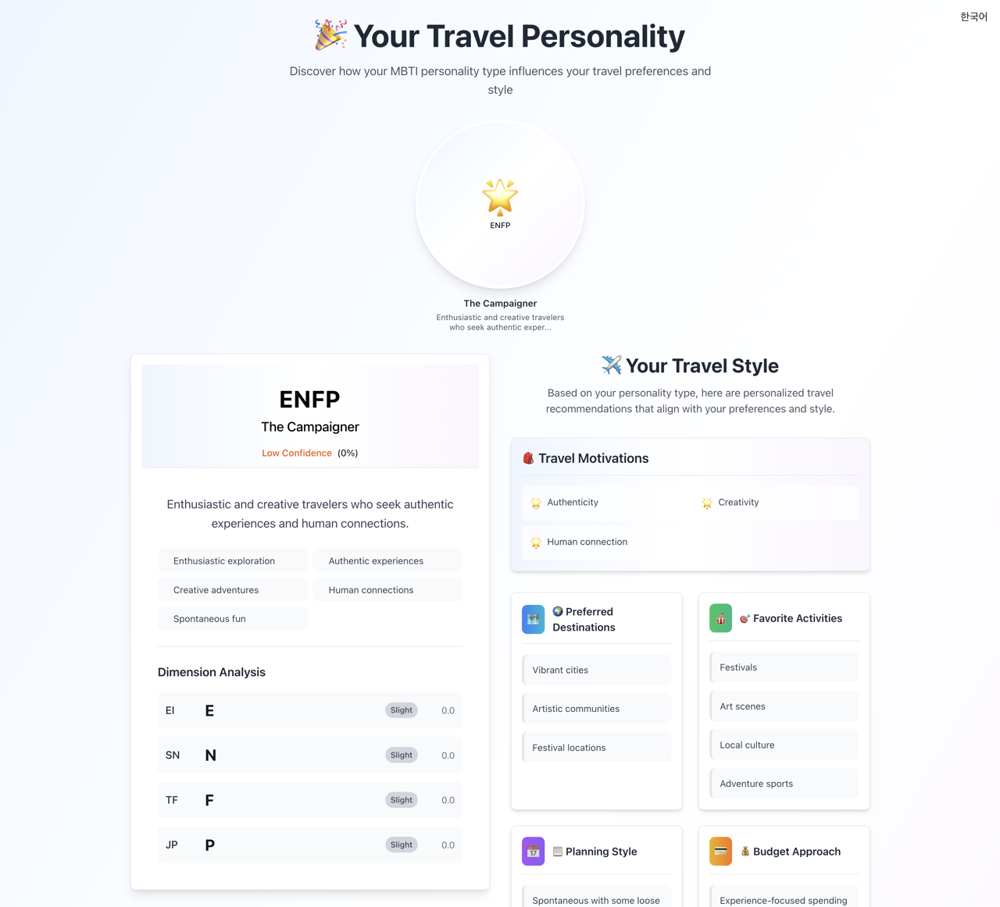
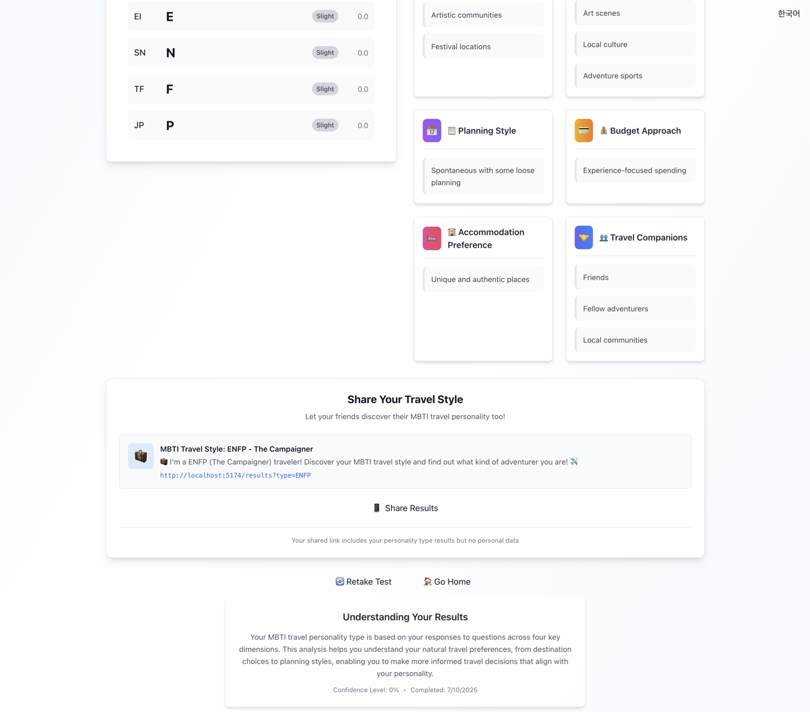
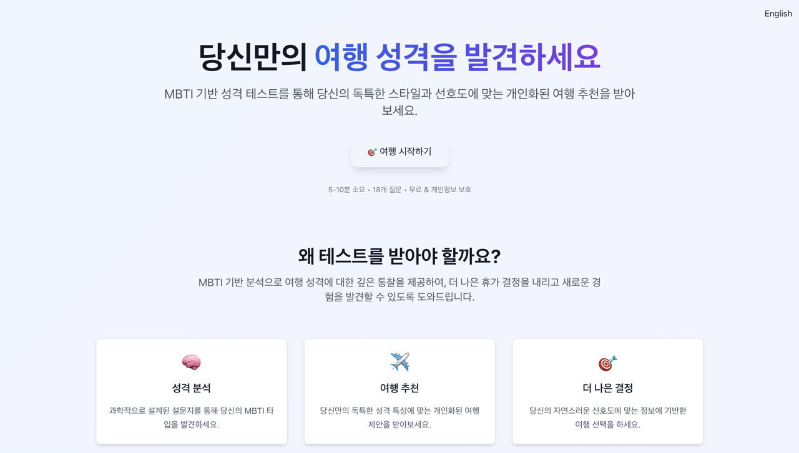
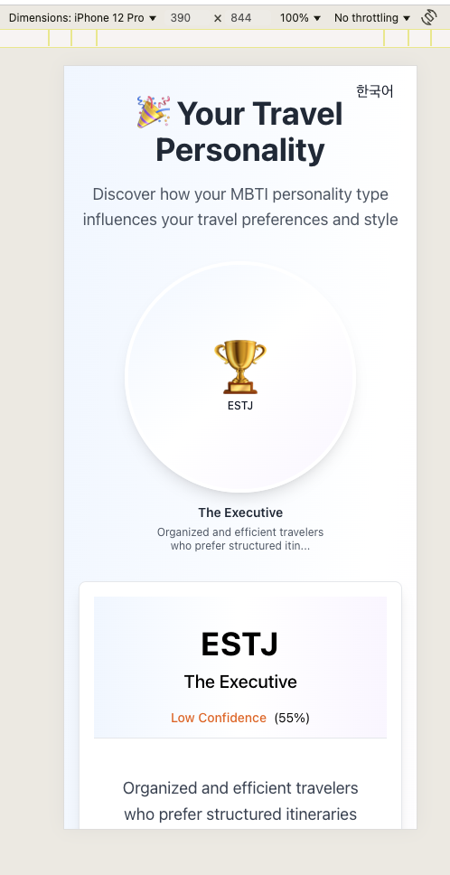
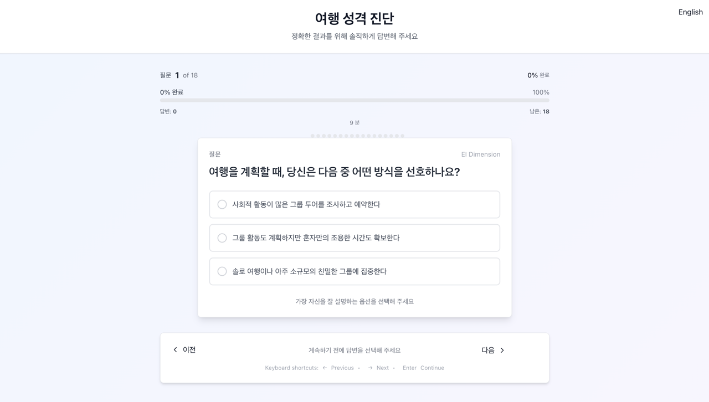
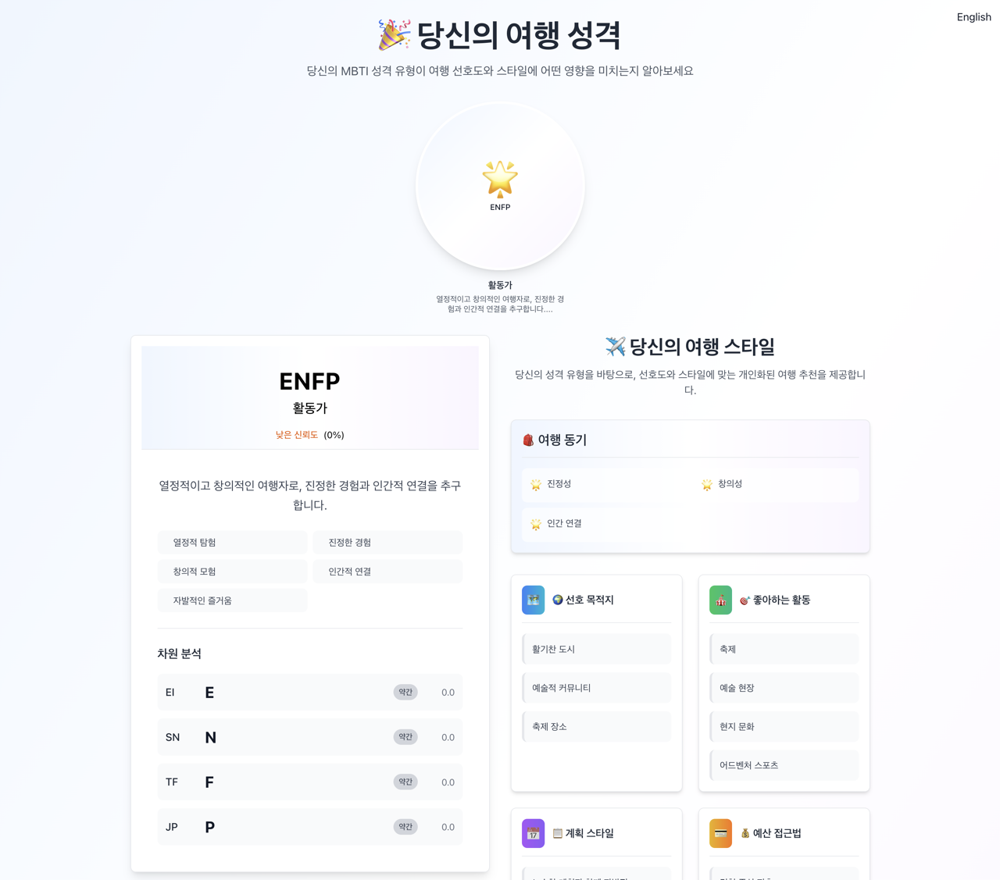
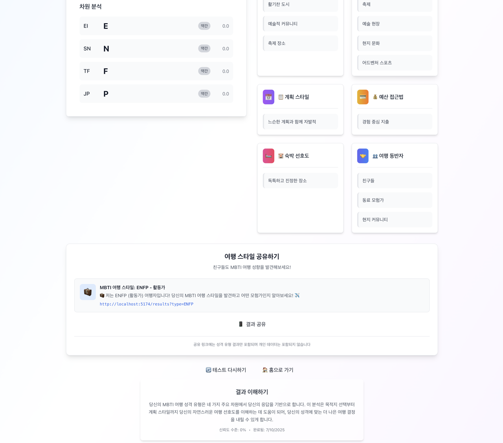
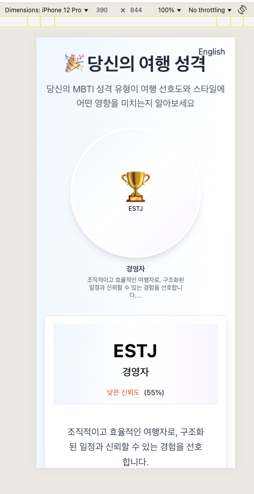

Live Link : https://travel-mbti-hello.netlify.app

[Cursor.ai](https://cursor.com/agents) + [Shrimp Task Manger](https://cjo4m06.github.io/mcp-shrimp-task-manager/) Vibe code Project

# 🧳 MBTI Travel Style Analysis

A comprehensive web application that analyzes your travel preferences through the lens of the Myers-Briggs Type Indicator (MBTI). Discover your unique travel personality and get personalized recommendations for destinations, activities, and travel planning approaches.


## 📸 Screenshots

### Home Page

_Clean and welcoming landing page with language selection_



### MBTI Test Interface

_User-friendly question interface with progress tracking_



### Results Dashboard

_Comprehensive MBTI travel personality analysis_




### Korean Language Support

_Full Korean translation with language switching_



### Mobile Responsive Design

_Optimized experience across all devices_



## ✨ Features

### 🎯 Core Functionality

- **15-20 Question MBTI Test**: Scientifically-based questions to determine your travel personality
- **16 MBTI Travel Profiles**: Detailed analysis for all Myers-Briggs types (ENTJ, ENTP, INTJ, etc.)
- **Personalized Recommendations**: Travel destinations, activities, planning styles, and accommodation preferences
- **Real-time Progress Tracking**: Visual progress indicators and estimated completion time

### 🌐 Multi-Language Support

- **English & Korean**: Complete translation system with dynamic language switching
- **Context-Aware Translations**: All content including MBTI descriptions, questions, and results
- **Persistent Language Preference**: Remembers your language choice across sessions

### 📱 User Experience

- **Responsive Design**: Optimized for desktop, tablet, and mobile devices
- **Smooth Animations**: Framer Motion powered transitions and micro-interactions
- **Auto-Save Progress**: Resume your test anytime with localStorage persistence
- **Auto-Submit**: Automatic submission when all questions are answered

### 🔗 Social Sharing

- **Native Share API**: Use device's built-in sharing when available
- **Copy Link Functionality**: Easy link sharing for any device
- **Localized Share Content**: Share messages adapt to selected language
- **Privacy-Focused**: No personal data in shared links

### 🎨 Design & Accessibility

- **Modern UI**: Clean, professional design with gradient accents
- **Keyboard Navigation**: Full keyboard support throughout the application
- **Loading States**: Smooth loading animations and feedback
- **Error Handling**: Graceful error states with recovery options

## 🚀 Quick Start

### Prerequisites

- Node.js 18+
- npm or yarn

### Installation

1. **Clone the repository**

   ```bash
   git clone <repository-url>
   cd shrimp
   ```

2. **Install dependencies**

   ```bash
   npm install
   ```

3. **Start development server**

   ```bash
   npm run dev
   ```

4. **Open in browser**
   Navigate to `http://localhost:5173`

### Build for Production

```bash
# Build the application
npm run build

# Preview the build
npm run preview
```

## 🛠️ Tech Stack

### Frontend Framework

- **React 18+**: Component-based UI library with hooks
- **TypeScript 5+**: Type-safe JavaScript development
- **Vite 7+**: Fast build tool and development server

### Styling & UI

- **Tailwind CSS 3+**: Utility-first CSS framework
- **Framer Motion**: Animation library for React
- **Custom Components**: Reusable UI component library

### State Management

- **React Context**: Global state for language and test progress
- **Custom Hooks**: Encapsulated business logic (`useMBTITest`, `useLanguage`, `useShare`)
- **LocalStorage**: Persistent state management

### Development Tools

- **ESLint**: Code linting and formatting
- **PostCSS**: CSS processing with Tailwind
- **TypeScript Compiler**: Type checking and compilation

## 📁 Project Structure

```
src/
├── components/          # Reusable UI components
│   ├── common/         # Shared components (LanguageSwitcher)
│   ├── layout/         # Layout components (AnimatedRoutes)
│   ├── results/        # Result page components
│   ├── test/          # Test interface components
│   └── ui/            # Base UI components (Button, Card, etc.)
├── contexts/          # React Context providers
├── data/             # Static data (MBTI types, questions)
├── hooks/            # Custom React hooks
├── pages/            # Page components
├── types/            # TypeScript type definitions
├── utils/            # Utility functions
└── translations/     # (Future: local translation files)

public/
├── translations/     # JSON translation files
│   ├── en.json      # English translations
│   └── ko.json      # Korean translations
└── images/          # Static assets
```

## 🎮 Available Scripts

```bash
# Development
npm run dev          # Start development server
npm run build        # Build for production
npm run preview      # Preview production build

# Code Quality
npm run lint         # Run ESLint
npm run type-check   # Run TypeScript compiler
```

## 🧪 Test Flow

1. **Home Page**: Introduction and test initiation
2. **Test Pages**: 15-20 MBTI-based questions with progress tracking
3. **Results Page**:
   - MBTI type identification
   - Travel personality description
   - Personalized travel recommendations
   - Social sharing options

## 🌍 Internationalization

The app supports English and Korean with a comprehensive translation system:

### Translation Files

- `public/translations/en.json` - English translations
- `public/translations/ko.json` - Korean translations

### Key Features

- Dynamic language switching
- Translated MBTI content
- Localized share messages
- Persistent language preference

### Adding New Languages

1. Create new translation file in `public/translations/`
2. Add language option to `LanguageContext`
3. Update `LanguageSwitcher` component

## 🔧 Development Guidelines

### Component Structure

- Follow functional component patterns with hooks
- Use TypeScript for all components
- Implement proper error boundaries
- Include accessibility attributes

### Styling Conventions

- Use Tailwind utility classes
- Implement responsive design patterns
- Follow consistent spacing and color schemes
- Use CSS-in-JS for dynamic styles when needed

### State Management

- Use React Context for global state
- Implement custom hooks for business logic
- Persist important state in localStorage
- Handle loading and error states

## 📊 MBTI Types Supported

**Analysts**: INTJ, INTP, ENTJ, ENTP
**Diplomats**: INFJ, INFP, ENFJ, ENFP  
**Sentinels**: ISTJ, ISFJ, ESTJ, ESFJ
**Explorers**: ISTP, ISFP, ESTP, ESFP

Each type includes:

- Personality description
- Travel motivations
- Preferred destinations
- Activity recommendations
- Planning style
- Budget approach
- Accommodation preferences
- Travel companion preferences

---

# 🧳 MBTI 여행 스타일 분석

Myers-Briggs 성격 유형 지표(MBTI)를 통해 여행 선호도를 분석하는 종합적인 웹 애플리케이션입니다. 당신만의 고유한 여행 성격을 발견하고 목적지, 활동, 여행 계획 방식에 대한 개인화된 추천을 받아보세요.


## 📸 스크린샷

### 홈 페이지

_언어 선택이 가능한 깔끔하고 친근한 랜딩 페이지_


### MBTI 테스트 인터페이스

_진행 상황 추적이 가능한 사용자 친화적 질문 인터페이스_



### 결과 대시보드

_종합적인 MBTI 여행 성격 분석_




### 영어 언어 지원

_언어 전환이 가능한 완전한 영어 번역_


### 모바일 반응형 디자인

_모든 디바이스에 최적화된 경험_



## ✨ 주요 기능

### 🎯 핵심 기능

- **15-20개 MBTI 테스트 질문**: 과학적 근거에 기반한 질문으로 여행 성격 파악
- **16가지 MBTI 여행 프로필**: 모든 Myers-Briggs 유형에 대한 상세 분석 (ENTJ, ENTP, INTJ 등)
- **개인화된 추천**: 여행 목적지, 활동, 계획 스타일, 숙박 선호도 추천
- **실시간 진행 상황 추적**: 시각적 진행 표시기와 예상 완료 시간

### 🌐 다국어 지원

- **한국어 & 영어**: 동적 언어 전환 기능이 있는 완전한 번역 시스템
- **맥락 인식 번역**: MBTI 설명, 질문, 결과를 포함한 모든 콘텐츠
- **언어 설정 저장**: 세션 간 언어 선택 기억

### 📱 사용자 경험

- **반응형 디자인**: 데스크톱, 태블릿, 모바일 기기에 최적화
- **부드러운 애니메이션**: Framer Motion 기반 전환 효과와 마이크로 인터랙션
- **자동 진행 상황 저장**: localStorage로 언제든지 테스트 재개 가능
- **자동 제출**: 모든 질문 답변 완료 시 자동 제출

### 🔗 소셜 공유

- **네이티브 공유 API**: 사용 가능한 경우 기기의 내장 공유 기능 사용
- **링크 복사 기능**: 모든 기기에서 쉬운 링크 공유
- **언어별 공유 콘텐츠**: 선택된 언어에 맞는 공유 메시지
- **개인정보 보호**: 공유 링크에 개인 데이터 포함하지 않음

### 🎨 디자인 & 접근성

- **모던 UI**: 그라디언트 액센트가 있는 깔끔하고 전문적인 디자인
- **키보드 탐색**: 애플리케이션 전체에서 완전한 키보드 지원
- **로딩 상태**: 부드러운 로딩 애니메이션과 피드백
- **오류 처리**: 복구 옵션이 있는 우아한 오류 상태

## 🚀 빠른 시작

### 필수 조건

- Node.js 18+
- npm 또는 yarn

### 설치

1. **저장소 복제**

   ```bash
   git clone <repository-url>
   cd shrimp
   ```

2. **의존성 설치**

   ```bash
   npm install
   ```

3. **개발 서버 시작**

   ```bash
   npm run dev
   ```

4. **브라우저에서 열기**
   `http://localhost:5173`으로 이동

### 프로덕션용 빌드

```bash
# 애플리케이션 빌드
npm run build

# 빌드 미리보기
npm run preview
```

## 🛠️ 기술 스택

### 프론트엔드 프레임워크

- **React 18+**: 훅을 사용한 컴포넌트 기반 UI 라이브러리
- **TypeScript 5+**: 타입 안전 JavaScript 개발
- **Vite 7+**: 빠른 빌드 도구 및 개발 서버

### 스타일링 & UI

- **Tailwind CSS 3+**: 유틸리티 우선 CSS 프레임워크
- **Framer Motion**: React용 애니메이션 라이브러리
- **커스텀 컴포넌트**: 재사용 가능한 UI 컴포넌트 라이브러리

### 상태 관리

- **React Context**: 언어 및 테스트 진행 상황을 위한 전역 상태
- **커스텀 훅**: 캡슐화된 비즈니스 로직 (`useMBTITest`, `useLanguage`, `useShare`)
- **LocalStorage**: 지속적인 상태 관리

### 개발 도구

- **ESLint**: 코드 린팅 및 포매팅
- **PostCSS**: Tailwind를 사용한 CSS 처리
- **TypeScript 컴파일러**: 타입 검사 및 컴파일

## 📁 프로젝트 구조

```
src/
├── components/          # 재사용 가능한 UI 컴포넌트
│   ├── common/         # 공유 컴포넌트 (LanguageSwitcher)
│   ├── layout/         # 레이아웃 컴포넌트 (AnimatedRoutes)
│   ├── results/        # 결과 페이지 컴포넌트
│   ├── test/          # 테스트 인터페이스 컴포넌트
│   └── ui/            # 기본 UI 컴포넌트 (Button, Card 등)
├── contexts/          # React Context 제공자
├── data/             # 정적 데이터 (MBTI 유형, 질문)
├── hooks/            # 커스텀 React 훅
├── pages/            # 페이지 컴포넌트
├── types/            # TypeScript 타입 정의
├── utils/            # 유틸리티 함수
└── translations/     # (향후: 로컬 번역 파일)

public/
├── translations/     # JSON 번역 파일
│   ├── en.json      # 영어 번역
│   └── ko.json      # 한국어 번역
└── images/          # 정적 자산
```

## 🎮 사용 가능한 스크립트

```bash
# 개발
npm run dev          # 개발 서버 시작
npm run build        # 프로덕션용 빌드
npm run preview      # 프로덕션 빌드 미리보기

# 코드 품질
npm run lint         # ESLint 실행
npm run type-check   # TypeScript 컴파일러 실행
```

## 🧪 테스트 플로우

1. **홈 페이지**: 소개 및 테스트 시작
2. **테스트 페이지**: 진행 상황 추적이 있는 15-20개의 MBTI 기반 질문
3. **결과 페이지**:
   - MBTI 유형 식별
   - 여행 성격 설명
   - 개인화된 여행 추천
   - 소셜 공유 옵션

## 🌍 국제화

앱은 포괄적인 번역 시스템으로 한국어와 영어를 지원합니다:

### 번역 파일

- `public/translations/en.json` - 영어 번역
- `public/translations/ko.json` - 한국어 번역

### 주요 기능

- 동적 언어 전환
- 번역된 MBTI 콘텐츠
- 지역화된 공유 메시지
- 지속적인 언어 설정

### 새로운 언어 추가

1. `public/translations/`에 새 번역 파일 생성
2. `LanguageContext`에 언어 옵션 추가
3. `LanguageSwitcher` 컴포넌트 업데이트

## 🔧 개발 가이드라인

### 컴포넌트 구조

- 훅을 사용한 함수형 컴포넌트 패턴 따르기
- 모든 컴포넌트에 TypeScript 사용
- 적절한 오류 경계 구현
- 접근성 속성 포함

### 스타일링 규칙

- Tailwind 유틸리티 클래스 사용
- 반응형 디자인 패턴 구현
- 일관된 간격 및 색상 체계 따르기
- 필요시 동적 스타일을 위한 CSS-in-JS 사용

### 상태 관리

- 전역 상태에 React Context 사용
- 비즈니스 로직을 위한 커스텀 훅 구현
- localStorage에 중요한 상태 저장
- 로딩 및 오류 상태 처리

## 📊 지원되는 MBTI 유형

**분석가형**: INTJ, INTP, ENTJ, ENTP
**외교관형**: INFJ, INFP, ENFJ, ENFP  
**관리자형**: ISTJ, ISFJ, ESTJ, ESFJ
**탐험가형**: ISTP, ISFP, ESTP, ESFP

각 유형별 포함 사항:

- 성격 설명
- 여행 동기
- 선호 목적지
- 활동 추천
- 계획 스타일
- 예산 접근법
- 숙박 선호도
- 여행 동반자 선호도
